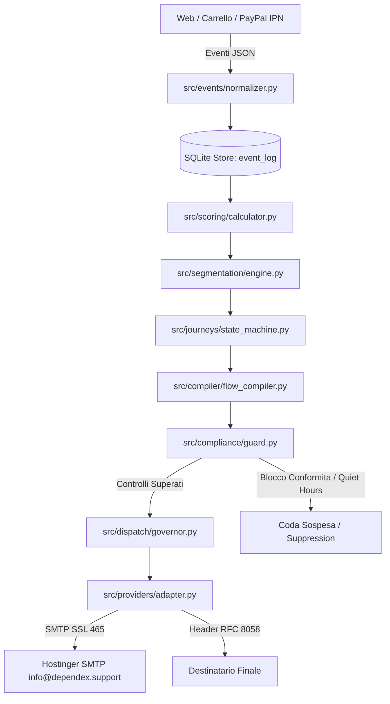

# UNIVERSAL EMAIL REVENUE OS — ARCHITECTURE & RUNTIME SPEC

**Versione:** 1.0 — 2026-09-06  
**Ecosistema:** Dependex.social · Oltre.social · Universal Email Revenue OS  
**Standard Operativo:** Metodo Karpathy (Spec → Verifier → Environment)

---

## 1. VISIONE GENERALE
Universal Email Revenue OS è un'infrastruttura di Email Marketing Automation auto-ospitabile, event-driven, dichiarativa (YAML DSL) e self-optimizing, integrata con GitHub Actions come control plane e orchestratore di job.

Il sistema gestisce l'intero customer lifecycle senza dipendenza da SaaS proprietari o container Docker:
`VISITOR` → `LEAD` → `ENGAGED` → `INTERESTED` → `HIGH_INTENT` → `BUYER` → `REPEAT_BUYER` → `VIP` → `DORMANT` → `REACTIVATED`.

---

## 2. MODULI CORE (`src/`)

1. **`src/events/`**:
   - `normalizer.py`: Convalida formale degli eventi contro lo schema versionato `schemas/event_schema_v1.json`.
   - `store.py`: Ingestione atomica e query cronologica su SQLite locale (`data/emailflux.db`).

2. **`src/consent/`**:
   - `ledger.py`: Tracciamento immutabile dei consensi (timestamp, IP, user-agent, sorgente) e gestione suppression list.

3. **`src/scoring/` & `src/segmentation/`**:
   - `calculator.py`: Calcolo deterministico di Lead Score, Engagement Score, Churn Risk e suggerimento transizione di stato.
   - `engine.py`: Raggruppamento automatico contatti per cluster e campagne mirate.

4. **`src/journeys/` & `src/compiler/`**:
   - `state_machine.py`: Macchina a stati finiti con matrice formale delle transizioni consentite.
   - `flow_compiler.py`: Parser di flussi dichiarativi YAML (`flows/`), calcolo step successivi ed exit conditions.

5. **`src/renderer/` & `src/compliance/`**:
   - `mjml_compiler.py`: Compilatore template responsive Luxury Dark & Gold con iniezione dinamica variabili e footer GDPR.
   - `guard.py`: Cancello di sicurezza ante-invio. Blocca istantaneamente email in suppression list, violazioni di quiet hours, assenza di link di disiscrizione o presenza di termini vietati.

6. **`src/providers/` & `src/dispatch/`**:
   - `adapter.py`: Connessione SMTP SSL 465 (Hostinger) con valorizzazione mittente ufficiale `info@dependex.support` e header standard RFC 8058.
   - `governor.py`: Throttling, rate limiting, warming IP e dispatching per lotti.

7. **`src/webhooks/`, `src/attribution/`, `src/experiments/`, `src/reporting/`, `src/optimizer/`**:
   - Gestione webhook PayPal e carrello, attribuzione entrate multicanale, calcolo varianti A/B test, reporting KPI e generazione raccomandazioni PR per l'auto-ottimizzazione.
